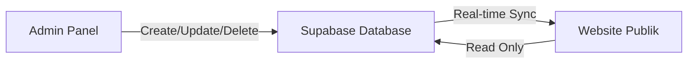

# 🔗 Panduan Integrasi: Admin Panel ⇄ Website Publik

## 📋 Ringkasan Integrasi

Sistem lowongan kerja sekarang **terintegrasi penuh** antara Admin Panel dan Website Publik menggunakan **Supabase** sebagai database.

---

## ✅ Yang T telah Diimplementasikan

### 1. **Database Schema** (`supabase/venues-schema.sql`)
- ✅ Tabel `venues` dengan Row Level Security (RLS)
- ✅ Auto-increment timestamps
- ✅ Public access untuk data aktif
- ✅ Admin-only access untuk CRUD operations
- ✅ Sample data (9 venues Bandung)

### 2. **API Layer** (`src/lib/venues.ts`)
- ✅ `getActiveVenues()` - Ambil semua venue aktif (public)
- ✅ `getAllVenues()` - Ambil semua venue (admin)
- ✅ `getVenuesByCity()` - Filter by kota
- ✅ `getVenueBySlug()` - Detail venue
- ✅ `createVenue()` - Tambah venue baru (admin)
- ✅ `updateVenue()` - Edit venue (admin)
- ✅ `deleteVenue()` - Hapus venue (admin)
- ✅ `uploadVenueImage()` - Upload gambar ke Supabase Storage
- ✅ Helper functions (generateSlug, base64ToFile)

### 3. **Admin Panel** (`src/app/admin/lowongan/page.tsx`)
- ✅ Real-time CRUD ke database
- ✅ List semua lowongan dengan search
- ✅ Form tambah/edit lowongan
- ✅ Upload gambar logo venue
- ✅ Toggle featured & status (aktif/nonaktif)
- ✅ Delete dengan konfirmasi
- ✅ Loading & saving states
- ✅ Error handling

### 4. **Website Publik** (`src/app/lowongan/page.tsx`)
- ✅ Dynamic fetch dari database
- ✅ Filter by kota (auto-generated dari data)
- ✅ Search functionality
- ✅ Loading state saat fetch
- ✅ Display gambar venue (jika ada)
- ✅ Featured badge
- ✅ Responsive grid layout
- ✅ Placeholder untuk kota lain

---

## 🔄 Cara Kerja Integrasi



### Flow:
1. **Admin menambah lowongan** di `/admin/lowongan`
2. **Data tersimpan** ke Supabase table `venues`
3. **Website otomatis menampilkan** data baru saat di-refresh
4. **Real-time** - Perubahan langsung terlihat setelah page reload

---

## 🚀 Cara Menggunakan

### Setup Database (First Time Only)

1. **Buka Supabase Dashboard**:
   - Login ke https://supabase.com
   - Pilih project Anda

2. **Jalankan SQL Schema**:
   ```sql
   -- Copy paste isi file: supabase/venues-schema.sql
   -- Ke SQL Editor di Supabase Dashboard
   -- Klik "Run"
   ```

3. **Verifikasi**:
   - Cek di Table Editor, seharusnya ada table `venues`
   - Sample data 9 venues Bandung sudah muncul

### Mengelola Lowongan di Admin Panel

#### **Tambah Lowongan Baru**:
1. Login as admin
2. Klik sidebar **"Lowongan Kerja"**
3. Klik tombol **"+ Tambah Lowongan"**
4. Isi form:
   - **Logo**: Upload gambar (opsional)
   - **Nama Venue**: Contoh "Denver Club"
   - **Kota**: Pilih dari dropdown
   - **Posisi**: Pilih dari dropdown
   - **Featured**: Centang untuk highlight
   - **Aktif**: Centang agar muncul di website
5. Klik **"Simpan"**
6. ✅ **Selesai!** Lowongan langsung muncul di website publik

#### **Edit Lowongan**:
1. Klik icon pensil (✏️) di kolom "Aksi"
2. Edit data yang diinginkan
3. Klik **"Simpan"**
4. ✅ Perubahan langsung terupdate di website

#### **Hapus Lowongan**:
1. Klik icon tempat sampah (🗑️) di kolom "Aksi"
2. Konfirmasi **"OK"**
3. ✅ Lowongan hilang dari website

#### **Refresh Data**:
- Klik tombol **"Refresh"** untuk reload data terbaru dari database

---

## 📱 Tampilan di Website Publik

### Halaman Lowongan (`/lowongan`)
- **Grid Layout**: Responsive 1-4 kolom
- **Featured Badge**: Badge gold untuk lowongan unggulan
- **Search Bar**: Cari by nama venue/kota/posisi
- **Filter Kota**: Otomatis generate dari data
- **Card Image**: Menampilkan logo venue (atau icon default)
- **Hover Effect**: "Lihat Detail" button muncul saat hover
- **Loading State**: Spinner saat fetch data

---

## 🔐 Security & Permissions

### Row Level Security (RLS)
```sql
-- Public dapat melihat venue aktif
CREATE POLICY "Public can view active venues" 
ON venues FOR SELECT 
USING (status = 'active');

-- Hanya admin yang bisa CRUD
CREATE POLICY "Admins can manage all venues" 
ON venues FOR ALL 
USING (EXISTS (
    SELECT 1 FROM profiles 
    WHERE id = auth.uid() AND role = 'admin'
));
```

### Siapa Bisa Apa:
| Role | View Active | View All | Create | Edit | Delete |
|------|-------------|----------|--------|------|--------|
| **Public User** | ✅ | ❌ | ❌ | ❌ | ❌ |
| **Admin** | ✅ | ✅ | ✅ | ✅ | ✅ |

---

## 📸 Image Upload

### Storage Setup (Supabase)
1. **Buat bucket** di Supabase Storage:
   - Nama: `images`
   - Public access: ON
   - File path pattern: `venues/*`

2. **Upload otomatis**:
   - Admin upload gambar via form
   - File disimpan ke `images/venues/<venue-id>-<timestamp>.png`
   - URL public otomatis di-generate
   - URL disimpan ke field `image_url`

### Supported Formats:
- JPG, PNG, GIF
- Max size: 2MB (bisa diubah di storage policies)

---

## 🎯 Key Features

### ✨ Real-time Sync
- **Instant Updates**: Data berubah di admin → langsung tampil di website (setelah refresh)
- **No Manual Sync**: Tidak perlu export/import manual

### 🔍 Smart Search
- Search by: Nama venue, Kota, Posisi
- Case-insensitive
- Real-time filtering

### 🏷️ Featured System
- Admin bisa mark venue sebagai "Featured"
- Featured venue dapat badge gold
- Prioritas tampilan di homepage (bisa dikembangkan)

### 📊 Dynamic Filters
- Filter kota auto-generate dari data
- Tidak perlu hardcode list kota
- Otomatis update saat ada kota baru

---

## 🐛 Troubleshooting

### ❌ Error: "Gagal memuat data lowongan"
**Solusi**:
1. Cek koneksi internet
2. Verifikasi Supabase credentials di `.env.local`:
   ```env
   NEXT_PUBLIC_SUPABASE_URL=https://xxx.supabase.co
   NEXT_PUBLIC_SUPABASE_ANON_KEY=eyJxxx...
   ```
3. Pastikan schema `venues` sudah dibuat
4. Cek console browser untuk error detail

### ❌ Gambar tidak muncul
**Solusi**:
1. Pastikan bucket `images` ada di Supabase Storage
2. Set public access untuk bucket
3. Cek URL gambar di database (field `image_url`)

### ❌ "Not authorized" saat CRUD
**Solusi**:
1. Pastikan user login sebagai admin
2. Cek role di table `profiles`:
   ```sql
   SELECT id, email, role FROM profiles WHERE email = 'your@email.com';
   ```
3. Update role jika perlu:
   ```sql
   UPDATE profiles SET role = 'admin' WHERE id = 'user-id';
   ```

---

## 🎓 Best Practices

### 1. **Data Consistency**
- Selalu isi field required: `name`, `city`, `position`
- Gunakan slug yang SEO-friendly (auto-generated dari nama)
- Pastikan status `active` untuk lowongan yang ingin ditampilkan

### 2. **Image Optimization**
- Compress gambar sebelum upload (optimal: < 200KB)
- Gunakan aspect ratio konsisten (1:1 recommended)
- Format PNG untuk logo dengan transparency

### 3. **Testing**
- Test di browser mode incognito untuk verifikasi public access
- Test responsive di mobile & tablet
- Test search & filter functionality

---

## 🔮 Potential Enhancements

### Quick Wins (Easy):
- [ ] **Bulk Actions**: Select multiple venues untuk delete/edit status
- [ ] **Export**: Download data lowongan sebagai CSV/Excel
- [ ] **Sorting**: Sort by tanggal dibuat, nama, kota
- [ ] **Pagination**: Limit 20 venues per page

### Advanced:
- [ ] **Real-time Updates**: WebSocket untuk auto-refresh tanpa reload
- [ ] **Draft Mode**: Save lowongan sebagai draft sebelum publish
- [ ] **Analytics**: Track views per lowongan
- [ ] **Application Form**: User bisa apply langsung dari website

---

## 📞 Support

Jika ada pertanyaan atau issue:
1. Cek dokumentasi Supabase: https://supabase.com/docs
2. Cek console browser untuk error logs
3. Review file: `src/lib/venues.ts` untuk API functions

---

**Status: ✅ PRODUCTION READY & FULLY INTEGRATED**

Made with ❤️ for Liguns Entertainment  
Database-Powered Job Listings System
